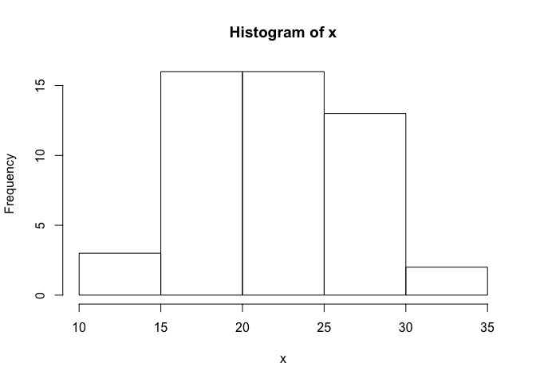
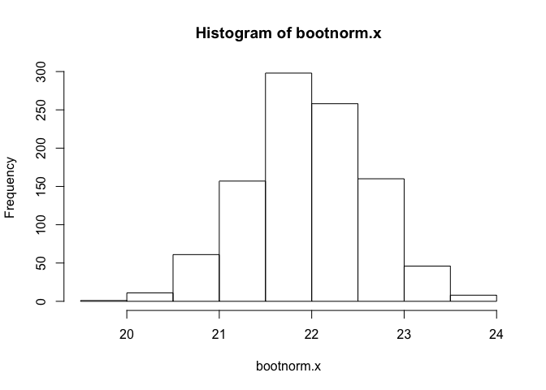
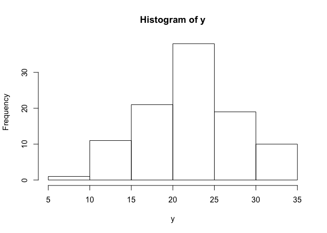
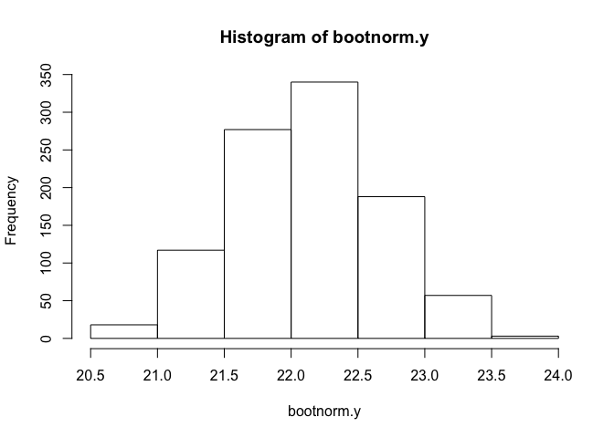
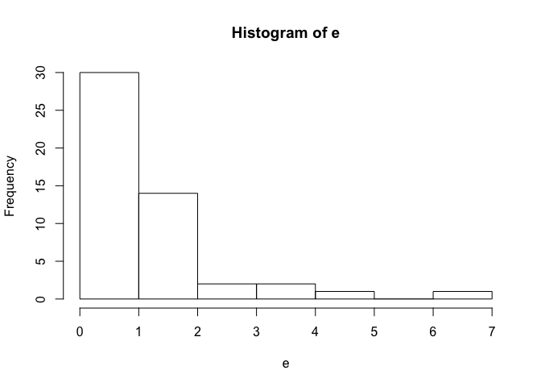
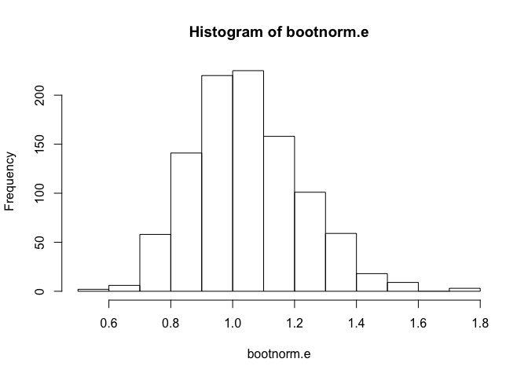
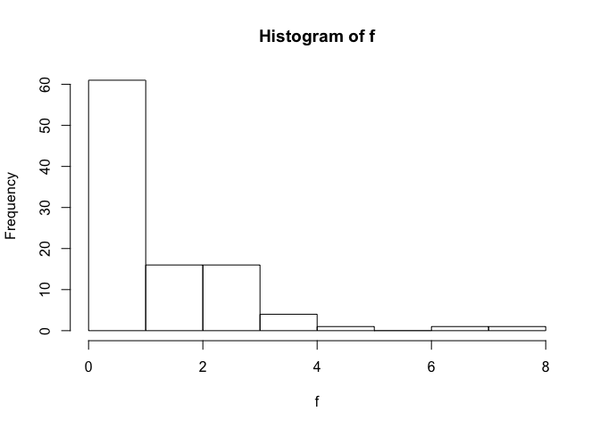
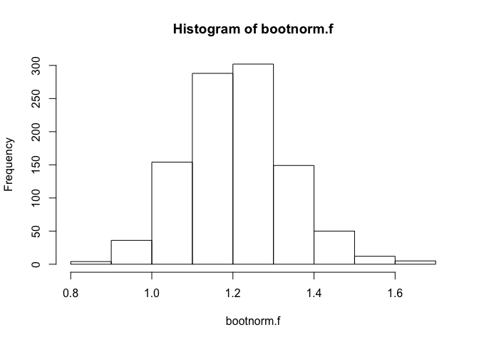

# 2016-0509 MSDS 6304 Week 4 Homework
Bill Kerneckel  
May 27, 2016  
<br>
<br>
<strong><u>Assignment:</u></strong><br>

Write bootstrap code to illustrate the central limit theorem in R markdown and push the result to GitHub. Use a <strong>normal distribution</strong> with two different sample sizes and an <strong>exponential distribution</strong> with two different sample sizes. Please also comment on the code and explain the results. 

------------
####First Normal Distribution Sample Size
<br>
<strong>Step 1:</strong> Generate normal distribution with a sample size of 50, mean of 22, and a standard deviation of 5.
<br>

```r
x <- rnorm(50, 22, 5)
```
<br>
<strong>Step 2:</strong> Now lets output the combined 'x' sample size to see if our above statements worked.
<br>

```r
x
```

```
##  [1] 19.47306 23.49160 19.72147 19.10968 10.48485 20.75327 22.38338
##  [8] 24.18798 23.65124 16.94938 15.05416 22.03993 24.94415 19.61603
## [15] 19.70238 18.55790 17.37101 23.83314 18.73057 21.50602 25.79919
## [22] 31.00927 28.15109 32.53284 20.20517 23.14601 30.50923 30.90647
## [29] 22.60721 19.05664 31.39408 26.66100 15.87557 23.02109 17.53529
## [36] 24.18627 24.41793 22.95119 16.44272 31.51180 23.59251 19.23259
## [43] 18.93322 21.97171 19.56832 25.34657 31.37682 22.73001 16.71630
## [50] 18.58724
```
<br>
<strong>Step 3:</strong> Lets take the mean of the 'x' sample size and look at the distrubtion. We use this later to compare against the bootstrap principal.
<br>

```r
xbar.x <- mean(x)
xbar.x
```

```
## [1] 22.35073
```

```r
hist(x)
```

<!-- -->
<br>

<strong>Step 4:</strong> Lets apply the bootstrap principal to illustrate the centeral limit theorem. First we need to set the repetitions to 1000.
<br>

```r
nsims <- 1000
```
<br>
<strong>Step 5:</strong> Now we need to loop 1000 repetitions through the combined 'z' sample size of 50. In the loop the following occurs:
  
1. Pulls one value from the 'x' sample size
2. Puts the one value back into the orginal 'x' sample population
3. Calculates 1000 means
<br>
<br>

```r
bootnorm.x <- numeric(nsims)
 	for (i in 1:nsims) {
	temp <- sample (x, 50, replace=TRUE)
	bootnorm.x[i] <- mean(temp)
 	}
```
<br>
<strong>Step 6:</strong> Lets see the summary of the bootstrap simulation.
<br>

```r
summary(bootnorm.x)
```

```
##    Min. 1st Qu.  Median    Mean 3rd Qu.    Max. 
##   20.41   21.89   22.35   22.36   22.82   24.54
```

```r
hist(bootnorm.x)
```

<!-- -->
<br>

<strong>Step 7:</strong> Now we can compare the bootstrap mean to the orginal mean of the 'x' sample size. You notice how close they are of being equal to each other. Lets compare the standard deviations of the orginal 'x' sample and of the bootstrap data.
<br>
<br>
X Sample mean<br>

```r
mean(x)
```

```
## [1] 22.35073
```
<br>
Bootnorm X sample mean<br>

```r
mean(bootnorm.x)
```

```
## [1] 22.36397
```
<br>
X Sample Standard Deviation<br>

```r
sd(x)
```

```
## [1] 4.895923
```
<br>
Bootnorm X Standard Deviation<br>

```r
sd(bootnorm.x)
```

```
## [1] 0.6991112
```
<br>

<strong>Step 8:</strong> If we take the standard deviation of the orginal 'x' sample size and divide it by the square root of the 'x' sample size of the orginal sample size (50) the results should be the near standard deviation of the x bootnorm sample. By comparing the two demostrates the central limit theorem.
<br>

```r
sd(x)/sqrt(50)
```

```
## [1] 0.692388
```
<br>
<hr>
####Second Normal Distribution Sample Size
<br>
<strong>Step 1:</strong> Generate normal distribution with a sample size of 100, mean of 22, and a standard deviation of 5.
<br>

```r
y <- rnorm(100, 22, 5)
```
<br>
<strong>Step 2:</strong> Now lets output the combined 'y' sample size to see if our above statements worked.
<br>

```r
y
```

```
##   [1] 18.79611 24.49980 27.69495 23.58131 26.35739 18.21693 20.83170
##   [8] 10.46996 21.63050 18.30724 21.17018 28.14516 24.08386 33.70571
##  [15] 33.43358 18.37465 14.29497 21.98990 17.34576 16.92128 23.20249
##  [22] 28.72209 11.56541 21.74140 23.67553 37.96672 27.62350 22.20276
##  [29] 14.05151 25.17199 24.57673 18.51021 30.16600 26.98181 31.64477
##  [36] 20.65936 20.94819 11.70262 32.16243 20.96291 21.96106 25.20730
##  [43] 18.86863 22.46664 22.65567 21.50987 17.70090 20.41094 22.46320
##  [50] 16.10875 26.51936 18.38638 25.41288 11.54334 23.56475 22.85174
##  [57] 33.16173 34.53290 22.82688 28.65810 19.36819 12.99033 26.25318
##  [64] 20.36500 22.88183 25.79976 24.54203 21.70432 23.45861 24.81667
##  [71] 20.49582 22.71958 31.14993 14.73772 19.96456 20.86654 21.02408
##  [78] 22.46021 19.59405 20.23470 24.44020 19.07412 21.86958 27.46715
##  [85] 22.08887 17.29909 20.34588 20.74260 20.68745 25.41848 24.61309
##  [92] 25.61017 22.08374 19.27315 32.56795 33.81134 24.94493 17.96399
##  [99] 31.04308 17.55217
```
<br>
<strong>Step 3:</strong> Lets take the mean of the 'y' sample size and look at the distrubtion. We use this later to compare against the bootstrap principal.
<br>

```r
xbar.y <- mean(y)
xbar.y
```

```
## [1] 22.75225
```

```r
hist(y)
```

<!-- -->
<br>

<strong>Step 4:</strong> Lets apply the bootstrap principal to illustrate the centeral limit theorem. First we need to set the repetitions to 1000.
<br>

```r
nsims <- 1000
```
<br>
<strong>Step 5:</strong> Now we need to loop 1000 repetitions through the combined 'y' sample size of 100. In the loop the following occurs:
  
1. Pulls one value from the 'y' sample size
2. Puts the one value back into the orginal 'y' sample population
3. Calculates 1000 means
<br>
<br>

```r
bootnorm.y <- numeric(nsims)
 	for (i in 1:nsims) {
	temp <- sample (y, 100, replace=TRUE)
	bootnorm.y[i] <- mean(temp)
 	}
```
<br>
<strong>Step 6:</strong> Lets see the summary of the bootstrap simulation.
<br>

```r
summary(bootnorm.y)
```

```
##    Min. 1st Qu.  Median    Mean 3rd Qu.    Max. 
##   21.20   22.41   22.74   22.75   23.09   24.50
```

```r
hist(bootnorm.y)
```

<!-- -->
<br>

<strong>Step 7:</strong> Now we can compare the bootstrap mean to the orginal mean of the 'y' sample size. You notice how close they are of being equal to each other. Lets compare the standard deviations of the orginal 'y' sample and of the bootstrap data.
<br>
<br>

Y Sample mean<br>

```r
mean(y)
```

```
## [1] 22.75225
```
<br>
Bootnorm Y sample mean<br>

```r
mean(bootnorm.y)
```

```
## [1] 22.75424
```
<br>
Y Sample Standard Deviation<br>

```r
sd(y)
```

```
## [1] 5.400652
```
<br>
Bootnorm Y Standard Deviation<br>

```r
sd(bootnorm.y)
```

```
## [1] 0.525455
```

<br>
<strong>Step 8:</strong> If we take the standard deviation of the orginal 'y' sample size and divide it by the square root of the 'y' sample size of the orginal sample size (100) the results should be the near standard deviation of the bootnorm Y sample. By comparing the two demostrates the central limit theorem.
<br>

```r
sd(y)/sqrt(100)
```

```
## [1] 0.5400652
```
<br>

<hr>
<p>The next part of the home work assignment was to demostrate using a exponential distribution with two different sample sizes.</p>
<br>
<hr>
####First Exponential Sample Size
<br>

<strong>Step 1:</strong> Generate exponential distribution with a sample size of 50.
<br>

```r
e <- rexp(50)
```
<br>
<strong>Step 2:</strong> Now lets output the combined 'e' sample size to see if our above statements worked.
<br>

```r
e
```

```
##  [1] 0.190339527 0.563546041 0.097675302 0.242424922 0.861428138
##  [6] 0.167997376 0.205723065 2.750013174 2.159523414 2.861222967
## [11] 0.592539707 1.437411503 0.640289870 2.859006448 0.719219278
## [16] 0.178999184 3.904396420 0.167899932 2.695947185 0.927532159
## [21] 0.233241631 0.149976402 1.980723962 0.002512533 2.009410841
## [26] 1.292384501 2.924830854 1.856349388 1.477108851 0.628572378
## [31] 0.528471094 0.481859496 0.879978097 0.568553487 1.755745801
## [36] 1.554510945 0.173860608 0.196159643 2.322451057 1.677606690
## [41] 0.630737579 0.955273071 0.564014590 0.204293736 0.651319770
## [46] 1.364340072 0.098986964 1.462185726 0.925385165 0.474567481
```
<br>
<strong>Step 3:</strong> Lets take the mean of the 'e' sample size and look at the distrubtion. We use this later to compare against the bootstrap principal.
<br>

```r
xbar.e <- mean(e)
xbar.e
```

```
## [1] 1.084971
```

```r
hist(e)
```

<!-- -->
<br>

<strong>Step 4:</strong> Lets apply the bootstrap principal to illustrate the centeral limit theorem. First we need to set the repetitions to 1000.
<br>

```r
nsims <- 1000
```
<br>
<strong>Step 5:</strong> Now we need to loop 1000 repetitions through the 'e' sample size of 50. In the loop the following occurs:
  
1. Pulls one value from the 'e' sample size
2. Puts the one value back into the orginal 'e' sample population
3. Calculates 1000 means
<br>
<br>

```r
bootnorm.e <- numeric(nsims)
 	for (i in 1:nsims) {
	temp <- sample (e, 50, replace=TRUE)
	bootnorm.e[i] <- mean(temp)
 	}
```
<br>
<strong>Step 6:</strong> Lets see the summary of the bootstrap simulation.
<br>

```r
summary(bootnorm.e)
```

```
##    Min. 1st Qu.  Median    Mean 3rd Qu.    Max. 
##  0.7126  0.9959  1.0890  1.0910  1.1840  1.5420
```

```r
hist(bootnorm.e)
```

<!-- -->
<br>

<strong>Step 7:</strong> Now we can compare the bootstrap mean to the orginal mean of the 'e' sample size. You notice how close they are of being equal to each other. Lets compare the standard deviations of the orginal 'e' sample and of the bootstrap data.
<br>
<br>
E Sample mean<br>

```r
mean(e)
```

```
## [1] 1.084971
```
<br>
Bootnorm E sample mean<br>

```r
mean(bootnorm.e)
```

```
## [1] 1.090524
```
<br>
E Sample Standard Deviation<br>

```r
sd(e)
```

```
## [1] 0.9540121
```
<br>
Bootnorm E Standard Deviation<br>

```r
sd(bootnorm.e)
```

```
## [1] 0.1375215
```
<br>

<strong>Step 8:</strong> If we take the standard deviation of the orginal 'e' sample size and divide it by the square root of the 'e' sample size of the orginal sample size (50) the results should be the near standard deviation of the e bootnorm sample. By comparing the two demostrates the central limit theorem.
<br>

```r
sd(e)/sqrt(50)
```

```
## [1] 0.1349177
```
<br>
<hr>
####Second Exponential Sample Size
<br>

<strong>Step 1:</strong> Generate exponential distribution with a sample size of 100.
<br>

```r
f <- rexp(100)
```
<br>
<strong>Step 2:</strong> Now lets output the combined 'f' sample size to see if our above statements worked.
<br>

```r
f
```

```
##   [1] 0.82635595 0.59145849 0.23692879 3.82350827 2.23943473 0.15457072
##   [7] 1.20659530 0.76571167 0.10762966 0.04452839 2.07578203 0.25929778
##  [13] 0.39152766 1.03073955 1.07169516 2.07089282 0.69587668 1.12155252
##  [19] 0.20581194 1.44543096 0.39065135 0.74492270 0.63211730 0.70178549
##  [25] 1.13454176 0.90114660 0.52861679 1.49027896 0.88322297 0.99910368
##  [31] 0.93570141 0.11261516 0.47094343 1.07109496 0.58800659 0.18276290
##  [37] 0.34714093 0.16411353 0.62933542 0.04637008 0.86950750 1.10413553
##  [43] 0.54850794 2.19621163 0.22624156 0.39157407 2.03469073 2.22966692
##  [49] 0.44641186 1.25143585 1.87466203 1.16218640 0.56114531 0.90590096
##  [55] 3.75360115 4.81270932 2.15590927 0.08677275 1.92993430 0.26247872
##  [61] 0.67579655 0.56128090 0.54683255 0.94363690 0.06985590 3.25381796
##  [67] 0.16169883 0.41536828 0.14248374 0.11741905 0.84900657 3.26794919
##  [73] 1.19498727 0.07355797 0.70901009 0.50440116 0.61340897 0.19444125
##  [79] 0.35429983 0.38480372 0.34146973 0.07431147 0.42995292 0.24987837
##  [85] 0.01049029 0.40097608 1.19338966 2.65137188 0.35918273 0.81994527
##  [91] 0.05467407 0.33766990 0.22270577 0.61872908 1.13358838 0.47696997
##  [97] 0.12553293 2.47690996 0.49824859 0.04533301
```
<br>
<strong>Step 3:</strong> Lets take the mean of the 'f' sample size and look at the distrubtion. We use this later to compare against the bootstrap principal.
<br>

```r
xbar.f <- mean(f)
xbar.f
```

```
## [1] 0.8967887
```

```r
hist(f)
```

<!-- -->
<br>

<strong>Step 4:</strong> Lets apply the bootstrap principal to illustrate the centeral limit theorem. First we need to set the repetitions to 1000.
<br>

```r
nsims <- 1000
```
<br>

<strong>Step 5:</strong> Now we need to loop 1000 repetitions through the combined 'f' sample size of 100. In the loop the following occurs:
  
1. Pulls one value from the 'f' sample size
2. Puts the one value back into the orginal 'f' sample population
3. Calculates 1000 means
<br>
<br>

```r
bootnorm.f <- numeric(nsims)
 	for (i in 1:nsims) {
	temp <- sample (f, 100, replace=TRUE)
	bootnorm.f[i] <- mean(temp)
 	}
```
<br>
<strong>Step 6:</strong> Lets see the summary of the bootstrap simulation.
<br>

```r
summary(bootnorm.f)
```

```
##    Min. 1st Qu.  Median    Mean 3rd Qu.    Max. 
##  0.6374  0.8331  0.8906  0.8943  0.9534  1.2250
```

```r
hist(bootnorm.f)
```

<!-- -->
<br>

<strong>Step 7:</strong> Now we can compare the bootstrap mean to the orginal mean of the 'f' sample size. You notice how close they are of being equal to each other. Lets compare the standard deviations of the orginal 'f' sample and of the bootstrap data.
<br>
<br>
F Sample mean<br>

```r
mean(f)
```

```
## [1] 0.8967887
```
<br>
Bootnorm F sample mean<br>

```r
mean(bootnorm.f)
```

```
## [1] 0.8943047
```
<br>
F Sample Standard Deviation<br>

```r
sd(f)
```

```
## [1] 0.9191417
```
<br>
Bootnorm F Standard Deviation<br>

```r
sd(bootnorm.f)
```

```
## [1] 0.09167737
```
<br>

<strong>Step 8:</strong> If we take the standard deviation of the orginal 'f' sample size and divide it by the square root of the 'f' sample size of the orginal sample size (100) the results should be the near standard deviation of the bootnorm F sample. By comparing the two demostrates the central limit theorem.
<br>

```r
sd(f)/sqrt(100)
```

```
## [1] 0.09191417
```
